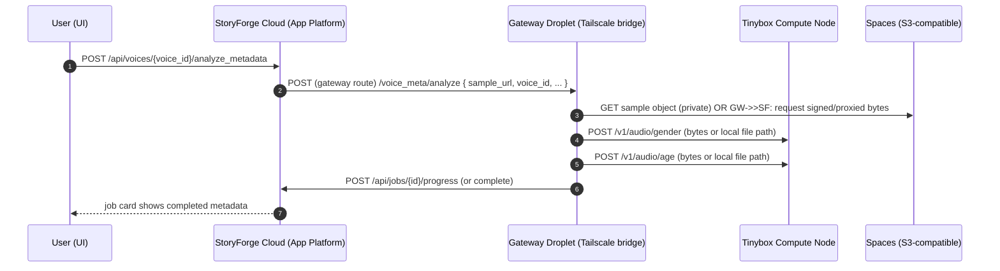
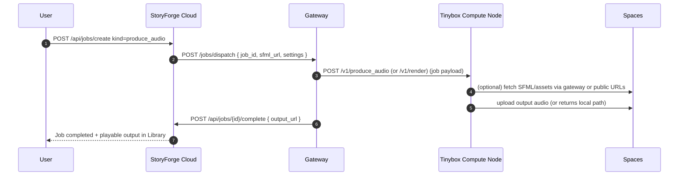

# StoryForge Infra & API Map (Cloud ↔ Gateway ↔ Tinybox)

Last updated: 2026-02-16

This document is the **single reference** for how StoryForge Cloud, the VPC/Gateway droplet, and Tinybox Compute Node interact.

---

## 0) Glossary / components

### StoryForge Cloud (App Platform)
- Public UI + API at: `https://storyforge.i0q.com/`
- Runs FastAPI app in: `storyforge/apps/app-platform/app/main.py`
- **Spaces access:** Cloud can upload/download to DigitalOcean Spaces **directly** via `boto3` (see `spaces_upload.py`). This does **not** require the Gateway.
- Auth model:
  - **Human UI**: passphrase cookie (`sf_sid`) via `auth.py`.
  - **Automation / internal callers**: token-gated endpoints (TODO token, deploy token, job token).

### Gateway (VPC gateway droplet)
- Purpose: the **private control plane bridge** between Cloud and Tinybox over **Tailscale**.
- Design intent: Cloud talks to Gateway (public HTTPS or DO-internal), then Gateway talks to Tinybox over Tailscale.
- Primary role: **Cloud ↔ Tinybox communication** (job dispatch, status, and any Tinybox-only network reachability).
- Non-goal: the Gateway is **not** required for Cloud ↔ Spaces; Cloud can talk to Spaces directly.

### Tinybox Compute Node (on Tinybox)
- FastAPI service (systemd) providing GPU/compute services and voice/audio classifiers.
- Repo: `I0Q/tinybox-compute-node`
- Canonical runtime checkout: `/raid/repos/tinybox-compute-node`
- Service reads env vars (systemd drop-ins) for auth + paths.

---

## 1) Network / trust boundaries (target architecture)

### High-level (intended)
- User (phone/browser) → **StoryForge Cloud** (public HTTPS)
- StoryForge Cloud → **Gateway** (public HTTPS or DO-internal)
- Gateway → **Tinybox** (Tailscale-only)

Key idea: **Tinybox should not need to reach Spaces directly** for private objects; it should ask via the **Gateway/Cloud control plane**.
- Cloud may still talk to Spaces directly (it has Spaces credentials).
- Gateway is primarily about Cloud ↔ Tinybox over Tailscale.

---

## 2) Sequence diagrams (core flows)

### 2.1 Analyze Voice (voice metadata: gender/age/pitch)

**Goal:** User triggers Analyze Voice in Cloud UI; the system fetches the voice sample audio and classifies it on Tinybox.



Notes:
- **Important**: the component that fetches the audio bytes should be the one that has the credentials (ideally **Gateway**).
- Tinybox should receive either:
  - a **private, gateway-served URL** reachable over Tailscale, or
  - the **audio bytes** streamed/uploaded in the request.

### 2.2 Produce Audio (render story)



### 2.3 TTS (voice sample generation)

```mermaid
sequenceDiagram
  autonumber
  participant U as User
  participant SF as StoryForge Cloud
  participant GW as Gateway
  participant TB as Tinybox Compute Node
  participant SP as Spaces

  U->>SF: POST /api/tts (engine, voice, text, params)
  SF->>GW: POST /tts { engine, voice_ref/url, text, params }
  GW->>TB: POST /v1/tts
  TB-->>GW: returns local file path OR bytes
  GW->>SP: upload to Spaces (private/public policy)
  GW-->>SF: return sample_url
  SF-->>U: UI plays sample; user may Save to roster
```

---

## 3) API endpoints (authoritative list)

### 3.1 StoryForge Cloud (App Platform) — user-facing + internal

#### Auth/session
- `GET /login` (HTML)
- `POST /login` (HTML form)
- `GET /logout`
- `POST /api/session` (token-gated automation cookie issuance)
  - Header: `x-sf-todo-token: <TODO_API_TOKEN>` OR `Authorization: Bearer <TODO_API_TOKEN>`

#### Deploy
- `GET /api/deploy/status` (unauthenticated allowed so boot watcher can load)
- `WS /ws/deploy` (deploy banner stream)

#### Jobs / History (token-gated for internal callers)
- `GET /api/jobs/stream` (SSE; UI)
- `GET /api/history` (UI)

#### Voices
- `GET /api/voices` (used by UI + internal)
- `POST /api/voices/{voice_id}/analyze_metadata` (creates a `kind=voice_meta` job)

#### Metrics
- `GET /api/metrics`
- `GET /api/metrics/stream?interval=` (SSE)

#### Production
- `GET /api/production/sfml/{story_id}` (token-gated allowlist in `auth.py`)
- `POST /api/production/casting_save`

#### Notifications
- `GET /api/notifications/vapid_public`
- `GET /api/notifications/settings`

> Note: Several internal endpoints are token-gated in `apps/app-platform/app/auth.py`:
> - `/api/todos*` via TODO token
> - `/api/deploy/*` via deploy token
> - `/api/jobs*`, `/api/voices*`, `/api/settings/providers`, `/api/production/sfml*` via job/todo/deploy token


### 3.2 Tinybox Compute Node (FastAPI) — callable via Gateway over Tailscale

Auth: `_auth(authorization)` is enforced on most endpoints.

#### Metrics / status
- `GET /v1/metrics`

#### TTS
- `POST /v1/tts`
  - engines: `xtts`, `tortoise`, `styletts2`
  - supports StyleTTS2 params via env vars mapping on Tinybox

#### Voice classifier endpoints
- `POST /v1/audio/analyze` (duration, LUFS, simple f0 features)
- `POST /v1/audio/gender`
- `POST /v1/audio/age`

Classifier runtime wiring:
- `VOICECLF_PY` points to classifier venv python
  - now set to: `/raid/repos/tinybox-compute-node/venv_voiceclf/bin/python`

#### LLM
- `POST /v1/llm` (proxy to local vLLM OpenAI endpoint)

---

## 4) Configuration & tokens

### 4.1 Tokens currently in use (Cloud)
- `PASSPHRASE_SHA256` (human UI)
- `TODO_API_TOKEN` (automation + TODO writes)
- `SF_DEPLOY_TOKEN` (CI deploy state hooks)
- `SF_JOB_TOKEN` (worker/job internal calls)

### 4.2 Tokens currently in use (Tinybox)
- Tinybox service expects Authorization header for protected endpoints (implementation-specific).

---

## 5) What we changed recently (relevant to this doc)

### 5.1 Tinybox classifier venv migration out of backup
- Copied `venv_voiceclf` from `/raid/_backup/...` into `/raid/repos/tinybox-compute-node/venv_voiceclf`
- Updated systemd to set:
  - `VOICECLF_PY=/raid/repos/tinybox-compute-node/venv_voiceclf/bin/python`

### 5.2 Known issue that triggered this work
- Tinybox classifier endpoints failed downloading `sample_url` with `HTTP 403 Forbidden`.
- Root cause: private asset fetch policy mismatch (Tinybox was downloading directly).
- Target fix (per Acacio): **route audio fetch via Gateway** using existing Tailscale gateway architecture.

---

## 6) TODO / next implementation steps (to align with gateway-first design)

### 6.1 Implement “gateway-served audio bytes” (preferred)
1) Add a **Gateway endpoint** (Tailscale-only) like:
   - `GET /internal/audio?url=<spaces_url_or_key>`
2) Gateway fetches audio using Spaces creds (or via Cloud with internal token) and serves it to Tinybox.
3) Tinybox classifier endpoints accept:
   - a gateway URL (Tailscale) OR
   - a pre-uploaded file path (if gateway uploads to Tinybox)

### 6.2 Tighten Cloud
- Cloud should not be required to expose an audio proxy publicly for Tinybox.
- Any existing proxy endpoints should be removed or restricted to gateway-only traffic.

---

## 7) Practical mapping: “who calls who”

- Cloud UI actions create jobs in Cloud DB.
- A worker/controller (should be Gateway) pulls jobs and calls Tinybox.
- Tinybox does compute and reports status back (through Gateway).
- Any access to Spaces private objects happens **in Cloud or Gateway**, not Tinybox.

---

## 8) File locations
- This document: `storyforge/docs/infra.md`
- Cloud auth gate: `storyforge/apps/app-platform/app/auth.py`
- Cloud app: `storyforge/apps/app-platform/app/main.py`
- Cloud Spaces helper: `storyforge/apps/app-platform/app/spaces_upload.py`
- Tinybox service: `tinybox-compute-node/app/main.py`
